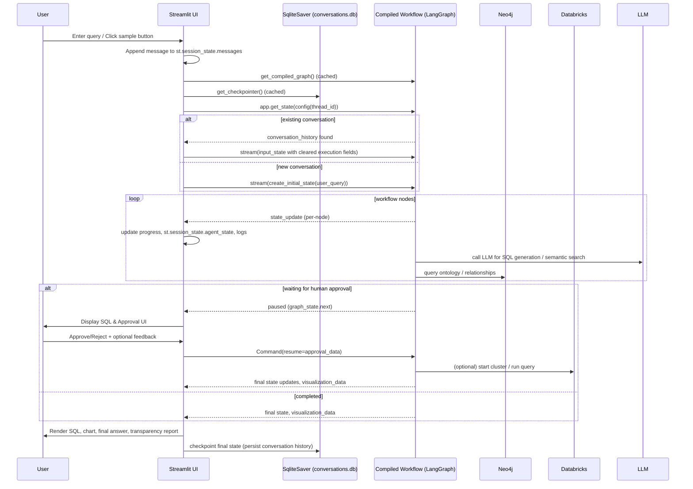

# NL → SQL Agent — Full Documentation

> This file contains:
> - Detailed explanation of the Streamlit `app.py` flow (agent state initialization, workflow execution, thread ID usage, visualization, human approval gate, transparency report).
> - A Mermaid sequence diagram describing the runtime interaction.
> - A Developer Onboarding Guide (prerequisites, setup, run, debug, extend, tests, deployment).
> 
> Generated: 2025-12-04

---

## Table of Contents
1. High-level architecture
2. Session state initialization
3. Checkpointing & workflow caching
4. Chat flow summary
5. Workflow execution logic
6. Initial state determination
7. Running the LangGraph workflow
8. Human approval — pause/resume logic
9. Displaying SQL and results
10. Visualization logic
11. Transparency report
12. Sidebar logic
13. Visualization key idea
14. Conversation history
15. Clear conversation logic
16. End-to-end flow diagram (sequence diagram)
17. Developer Onboarding Guide
18. Appendix / Quick commands

---

# 1. High-Level Architecture

Your application uses:

- **LangGraph (Workflow Engine)**: Defines the multi-step agent:
  - Parse intent → Fetch joins → Generate SQL → Validate SQL → Get Human Approval → Execute → Visualize → Answer.
  - Supports pause/resume (`Command(resume=...)`).
  - Checkpoints state using a persistent SQLite DB.

- **SqliteSaver (Checkpoint Storage)**:
  - Stores state keyed by a **thread ID**, so each session preserves multi-turn context.
  - Allows workflow to resume exactly where it left off.

- **Streamlit Chat UI**
  - Streams user messages
  - Displays SQL previews, logs, visualizations, transparency report, and agent status.

---

# 2. Session State Initialization

Streamlit's `st.session_state` is used to maintain continuity across page reruns.

Key fields:
- `messages`: UI chat transcript
- `agent_state`: Last known agent workflow state (latest)
- `workflow_running`: Bool flag if workflow running
- `pending_query`: Query selected from sample buttons
- `thread_id`: UUID to identify the conversation / checkpoint
- `waiting_for_approval`: Bool flag for paused workflows waiting for human approval

`thread_id` is generated as:
```python
st.session_state.thread_id = str(uuid.uuid4())
```

This `thread_id`:
- Distinguishes each conversation
- Controls which checkpoint to read/write
- Ensures multi-turn memory in LangGraph

---

# 3. Checkpointing & Workflow Caching

### Checkpointer (SQLite-backed persistent memory)
```python
@st.cache_resource
def get_checkpointer():
    conn = sqlite3.connect("conversations.db", check_same_thread=False)
    checkpointer = SqliteSaver(conn)
    checkpointer.setup()
    return checkpointer
```

### Compiled Workflow
```python
@st.cache_resource
def get_compiled_graph():
    workflow = create_workflow()
    return workflow.compile(checkpointer=get_checkpointer())
```

Caching avoids reloading the LangGraph state machine on every rerun.

---

# 4. Chat Flow Summary

A message enters via:

- **Sample Query Buttons** → stored into `pending_query`
- **Chat Input** → via `st.chat_input()`

Processing steps:
1. Add user message to history (`st.session_state.messages`)
2. Display message
3. Trigger `run_agent_workflow(prompt)`
4. Stream workflow, store `agent_state`, and render results

---

# 5. Workflow Execution Logic

Core engine:
```python
agent_state = run_agent_workflow(prompt)
```

**run_agent_workflow**:
- Loads compiled `app` (LangGraph)
- Builds `config` with `thread_id`
- Checks for existing checkpoint: `app.get_state(config)`
- If existing conversation, preserves `conversation_history` and clears execution-specific fields
- If new conversation, calls `create_initial_state(user_query)`
- Streams via `app.stream(input_state, config, stream_mode="values")`
- On each `state_update`, updates:
  - progress bar
  - status placeholder
  - `st.session_state.agent_state`
  - debug toasts/logs
- After streaming, checks `app.get_state(config).next` to detect interrupt/pause (human approval)
- Returns the final `agent_state`

---

# 6. How Initial State is Determined

The system checks if a previous workflow exists for this `thread_id`:

```python
graph_state = app.get_state(config)
if graph_state and graph_state.values.get("conversation_history"):
    # Follow-up: preserve conversation history, reset execution state fields
else:
    input_state = create_initial_state(user_query)
```

If follow-up: clears `generated_sql`, results, visualization data, etc., but preserves conversation history so the LLM maintains context.

---

# 7. Running the LangGraph Workflow

Executed incrementally:

```python
for state_update in app.stream(input_state, config, stream_mode="values"):
    # state_update is the full agent state after each node
    st.session_state.agent_state = current_state
```

Interrupt detection (approval gate):
```python
graph_state = app.get_state(config)
if graph_state.next:
    st.session_state.waiting_for_approval = True
```

---

# 8. Human Approval — Pause/Resume Logic

When the workflow stops at an approval node:

- UI renders approval panel with Approve / Reject buttons
- On Approve/Reject:
  ```python
  resume_workflow_with_approval(approved=True/False)
  ```
- Resume performs:
  ```python
  for state_update in app.stream(Command(resume=approval_data), config, stream_mode="values"):
  ```
- The workflow continues from the paused node and completes.

---

# 9. Displaying SQL and Results

If SQL generated:
- `display_sql_preview(sql, formatted_sql)` shows SQL with syntax highlighting and copy area.
- Shows validation status (`sql_valid`).
- If human approval required, the UI pauses and awaits input.
- If executed, shows `final_answer` and `sql_results` count.

If errors:
- `agent_state['error']` triggers error UI and a transparency report.

---

# 10. Visualization Logic

Two visualization types:

### Standard SQL Aggregation Charts
- Stored as `visualization_data` (Plotly JSON)
- `visualization_type` describes chart
- Rendered:
  ```python
  fig = go.Figure(json.loads(agent_state["visualization_data"]))
  st.plotly_chart(fig, use_container_width=True)
  ```

### Genealogy Graph Visualizations
- If `genealogy_graph` present, graph visualization may be in `visualization_data` as Plotly JSON
- Show graph, metrics (nodes, edges, problem batches), or fallback JSON table

Charts use unique keys like `viz_{len(messages)}` to force updates across reruns.

---

# 11. Transparency Report

Structured `step_explanations` exist:
- Each step logs `{step, action, details, ...}`
- UI renders:
  - Semantic search results & scores
  - Relationships found
  - Column lists
  - SQL composition & join decisions
  - Model info and temperature
- Helps users understand reasoning and reproduce decisions

---

# 12. Sidebar Logic

- API Key detection (`OPENAI_API_KEY`)
- Neo4j connectivity check (`get_neo4j_connection`)
- Databricks cluster status & start button (`get_cluster_state`, `start_cluster`)
- Sample queries grouped by scenario; selecting sets `st.session_state.pending_query`
- Clear conversation button:
  - resets messages, agent_state, new thread_id, waiting_for_approval=False

---

# 13. Visualization Key Idea

Using a unique key per chart prevents stale charts being reused across multi-turn conversations:
```python
chart_key = f"viz_{len(st.session_state.messages)}"
st.plotly_chart(fig, key=chart_key)
```

---

# 14. Conversation History

Two histories:
- `st.session_state.messages` (UI transcript)
- LangGraph `conversation_history` stored in checkpoint (for prompting LLM)

`thread_id` links them.

---

# 15. Clear Conversation Logic

`Clear Conversation`:
- `st.session_state.messages = []`
- `st.session_state.agent_state = None`
- `st.session_state.thread_id = str(uuid.uuid4())`
- `st.session_state.waiting_for_approval = False`
- `st.rerun()`

Generates brand new LangGraph checkpoint space for subsequent runs.

---

# 16. End-to-End Sequence Diagram (Mermaid)

Below is a Mermaid sequence diagram describing the runtime interaction. You can paste this into any Mermaid-enabled renderer (e.g., GitHub README, Mermaid Live Editor) to visualize it.



---

# 17. Developer Onboarding Guide

This section helps a new developer get the code running and understand how to extend it.

## Prerequisites
- Python 3.10+ (recommend 3.11)
- Node/npm **not** required for core streamlit app
- `pip` for package installation
- Access to:
  - OpenAI API key (or LLM provider configured in environment)
  - Neo4j instance (ontology DB)
  - Databricks account (optional, for cluster/execution)
- Recommended: virtualenv or conda environment

## Required Environment Variables
Create a `.env` (or export in your shell):
```
OPENAI_API_KEY=your-openai-api-key-here
NEO4J_URI=bolt://<host>:7687
NEO4J_USER=neo4j
NEO4J_PASSWORD=...
DATABRICKS_TOKEN=...
DATABRICKS_HOST=...
```

## Python dependencies (example)
```text
streamlit
langgraph
langgraph-checkpoint-sqlite
plotly
pandas
neo4j
python-dotenv
databricks-sdk
sqlite3 (stdlib)
```

Install:
```bash
python -m venv .venv
source .venv/bin/activate
pip install -r requirements.txt
```

## Project Layout (minimum relevant files)
```
.
├─ app.py
├─ agent/
│  ├─ workflow.py
│  └─ state.py
├─ tools/
│  ├─ neo4j_tool.py
│  └─ databricks_connection.py
├─ conversations.db   # created automatically
├─ ontology.db         # if your project uses file-based ontology DB
└─ requirements.txt
```

## Run Locally
```bash
streamlit run app.py
```
Open http://localhost:8501

## Developer Workflow (quick)
1. Clone repo
2. Create .env (set keys)
3. Install deps
4. Run Streamlit
5. Use sample queries to exercise nodes
6. Check `conversations.db` to inspect checkpointed state

## Debugging Tips
- Add `st.write()` or `st.code()` to inspect `agent_state` shape while streaming.
- Use SQLite viewer (DB Browser for SQLite) to inspect `conversations.db`.
- If LangGraph workflow appears stuck, check `graph_state.next` and `agent_state["current_step"]`.
- Use `st.session_state.thread_id` to correlate UI session to checkpoint entries.
- Surround risky sections with try/except and show `traceback.format_exc()` in `st.code()` (already implemented).

## Extending the Workflow
- Add nodes to `agent/workflow.py`.
- When adding approval gates, use `Command(resume=...)` pattern for resuming.
- For new visualizations, serialize plotly figure to JSON and set `visualization_data` in state.
- For new persistence, implement/plug a new checkpointer and ensure `compile(checkpointer=...)` is passed.

## Testing
- Unit test nodes in isolation (`pytest`).
- Integration tests: run a headless streamlit session or directly call the `app.stream(...)` API in tests.
- Add deterministic mock LLM responses during tests to avoid flakiness.

## Deployment
- Containerize with Docker if needed.
- Ensure `conversations.db` is persisted between container restarts (volume).
- Use Streamlit Cloud, AWS, GCP, or Azure Web App to host. Ensure env vars & network access to Neo4j/Databricks.
- For multi-user production, consider upgrading checkpointer to multi-tenant DB.

---

# 18. Appendix / Quick commands

- Run Streamlit locally:
```bash
streamlit run app.py
```

- Recreate virtual environment:
```bash
rm -rf .venv
python -m venv .venv
source .venv/bin/activate
pip install -r requirements.txt
```

- Inspect conversations DB:
```bash
sqlite3 conversations.db
.tables
SELECT * FROM checkpoints LIMIT 10;
```

---

# End
If you'd like:
- I can **export a PNG** of the sequence diagram (requires rendering tool) — tell me if that's needed.
- I can produce a **README.md** trimmed for GitHub with badges and quick start.
- I can generate a **PDF** version of this doc.

